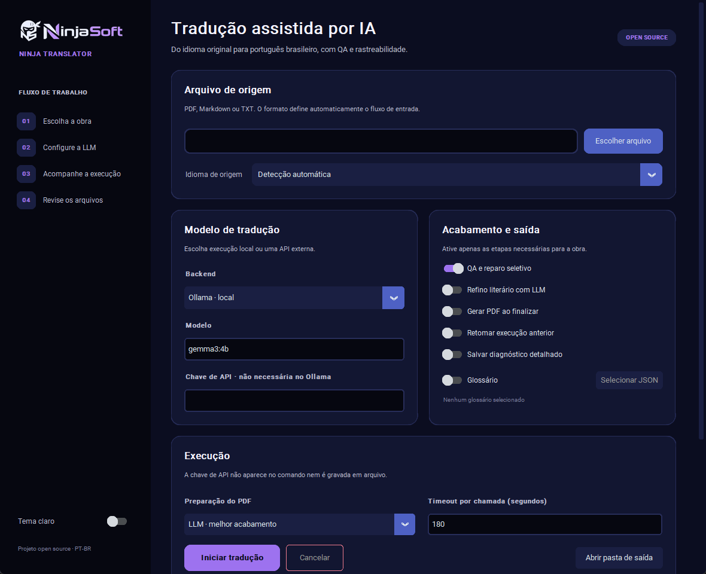

# Ninja Translator

Tradutor multilíngue de Light Novels e documentos para PT-BR.

Pipeline em Python 3.10+ para traduzir PDFs e Markdown de inglês, japonês, coreano, chinês e outros idiomas para PT-BR. Usa LLM local ou API externa, extrai e limpa o texto, traduz em chunks, repara falhas objetivas, refina e gera relatórios e PDF. O projeto prioriza Windows, mas também funciona em Linux.

## Requisitos e instalação
- Python 3.10 ou superior.
- Backend LLM:
  - Ollama (padrão): execução local, configurada em `config.yaml`.
  - Gemini: use o SDK atual `google-genai` e defina `GEMINI_API_KEY`.
  - OpenAI: usa a Responses API; defina `OPENAI_API_KEY`.
- Instalação mínima:
  ```bash
  pip install -r requirements.txt
  ```
- Ambiente de desenvolvimento:
  ```bash
  pip install -r requirements-dev.txt
  pytest -q
  pre-commit install
  pre-commit run --all-files
  ```
Todas as fontes são UTF-8 (ver testes e hook de mojibake). Use editor com UTF-8.

## Hardware e modos de execução

Uma placa NVIDIA RTX não é obrigatória. O hardware necessário depende do
backend, do modelo, da quantização e do tamanho de contexto escolhidos. O
`config.example.yaml` usa `gemma3:4b`, um ponto de partida mais acessível para
execução local.

| Cenário | Configuração prática | Observações |
| --- | --- | --- |
| Gemini ou OpenAI | CPU atual, 8 GB de RAM e conexão com a internet | Não exige GPU dedicada; os chunks são enviados ao provedor selecionado. |
| Ollama somente em CPU | 16 GB de RAM | É suportado, mas tende a ser consideravelmente mais lento em livros longos. |
| Ollama local de entrada | 16 GB de RAM e GPU compatível com 6–8 GB de VRAM | Faixa adequada para começar com modelos quantizados em torno de 4B e contexto de aproximadamente 4k. |
| Ollama local recomendado | 32 GB de RAM e GPU compatível com 12 GB ou mais de VRAM | Oferece mais margem para modelos de 8B–14B, contextos maiores e etapas de reparo/refino. |
| Modelos locais de 20B ou mais | 64 GB de RAM e/ou 20–24 GB de VRAM | Pode exigir offload parcial para CPU; consumo e velocidade variam bastante entre modelos e quantizações. |

Essas faixas são referências práticas, não requisitos rígidos. Uma NVIDIA RTX
compatível é uma boa opção para acelerar o Ollama no Windows, mas o runtime
também aceita execução em CPU e oferece suporte a GPUs AMD e Apple Metal. Em
qualquer plataforma, confirme a compatibilidade na
[documentação de hardware do Ollama](https://docs.ollama.com/gpu).

O consumo de memória cresce com o modelo e com `*_num_ctx`. Antes de iniciar um
livro completo, faça um teste com poucos chunks e use `ollama ps` para verificar
se o modelo ficou em GPU, CPU ou dividido entre ambos. Reduza o modelo ou o
contexto se houver offload excessivo, falta de memória ou desempenho inviável.

## Interface gráfica

A interface desktop oferece seleção de arquivos, idioma, backend, modelo,
glossário e acabamento final, além de logs em tempo real e cancelamento seguro.
Ela usa a mesma CLI por baixo dos panos, portanto gera os mesmos caches,
relatórios e saídas auditáveis do fluxo por comando.



```bash
python interface.py

# Forma equivalente
python -m tradutor.gui
```

As chaves de Gemini e OpenAI informadas na tela são repassadas apenas ao
processo atual e não são gravadas no projeto. Também é possível continuar
usando `GEMINI_API_KEY` ou `OPENAI_API_KEY` no ambiente. Em distribuições Linux
que não incluem Tk por padrão, instale o pacote `python3-tk` do sistema.

## Idiomas de origem

O destino atual é sempre português brasileiro. A opção `source_language: auto`
faz uma detecção local e leve antes de enviar os chunks à LLM. Também é possível
fixar o idioma com `--source-language`; isso é recomendado para textos curtos,
mistos ou ambíguos.

Idiomas configuráveis: `en`, `ja`, `ko`, `zh`, `es`, `fr`, `de`, `it`, `ru`,
`ar`, `pl`, `nl`, `tr`, `id`, `vi` e `th`. O catálogo central fica em
`tradutor/languages.py`.

```bash
python -m tradutor.main traduz-md \
  --input "data/volume_jp.md" \
  --source-language ja

python -m tradutor.main traduz \
  --input "data/volume.pdf" \
  --source-language auto \
  --backend openai \
  --model "<modelo-disponível-na-sua-conta>"
```

Ao usar Gemini ou OpenAI, os chunks são enviados ao provedor escolhido. Consulte
as políticas do provedor antes de processar material sensível. Referências:
[Google Gen AI SDK](https://ai.google.dev/gemini-api/docs/libraries) e
[OpenAI Responses API](https://developers.openai.com/api/reference/resources/responses/methods/create).

## Guia rápido
### Configuração local
O repositório mantém apenas `config.example.yaml`, com valores portáteis e sem
caminhos de uma máquina específica. Crie sua configuração local antes de rodar
o pipeline:

```bash
# Linux/macOS
cp config.example.yaml config.yaml

# PowerShell
Copy-Item config.example.yaml config.yaml
```

`config.yaml` é ignorado pelo Git. Ajuste nele o backend, os modelos disponíveis,
os limites de contexto, os diretórios e as fontes de PDF do seu ambiente. Flags
da CLI continuam tendo precedência sobre o arquivo.

Para produzir os arquivos de inspeção da tradução (extraído, preprocessado, desquebrado e traduzido), rode com `--debug`. Acrescente `--refine` apenas quando quiser avaliar a pós-edição LLM:

```bash
python -m tradutor.main traduz \
  --input "data/meu_livro.pdf" \
  --use-glossary \
  --request-timeout 600 \
  --clear-cache all \
  --debug
```

### 1) Traduzir PDF (padrão seguro)
```bash
python -m tradutor.main traduz --input "data/meu_livro.pdf" --use-glossary
```
Saídas em `saida/`: `meu_livro_pt.md`, relatórios JSON e caches (ver Outputs). Use `--refine` para também gerar `meu_livro_pt_refinado.md`; ele só é mantido quando o QA final não fica pior que o da tradução.

### 2) Traduzir Markdown já desquebrado
```bash
python -m tradutor.main traduz-md --input "saida/meu_texto_desquebrado.md"
```

### 3) Refine separado
```bash
python -m tradutor.main refina --input "saida/meu_livro_pt.md"
```

### 4) Gerar PDF a partir do MD
```bash
python -m tradutor.main pdf --input "saida/meu_livro_pt_refinado.md"
```

## Pipeline v4 (como o código executa)
Diagrama e regra completa: [docs/PIPELINE.md](docs/PIPELINE.md).

1) **Extração e pré-processo** (`tradutor/preprocess.py::extract_text_from_pdf`, `preprocess_text`):
   - Normaliza quebras, remove rodapés/ruído e front-matter/TOC se `skip_front_matter` estiver ativo (padrão vindo do config).
2) **Desquebrar** (`tradutor/desquebrar.py::desquebrar_text`):
   - LLM ou modo seguro (`desquebrar_safe`) junta linhas, corrige hifenização/aspas e valida saída.
   - Controlado por `--use-desquebrar/--no-use-desquebrar` e `--desquebrar-mode llm|safe`.
3) **Chunking e tradução** (`tradutor/translate.py::translate_document`):
   - Divide por seções se `split_by_sections` ativo (usa `tradutor/section_splitter.py`).
   - Repara apenas aberturas de diálogo ausentes que sejam estruturalmente inequívocas e evita cortar chunks no meio de falas sempre que houver uma fronteira segura próxima.
   - Tradução chunk a chunk com glossário manual por chunk, contexto deslizante, perfil automático diálogo/narração, guardrails de diálogo, retries e sanitização.
   - Saídas: `_pt.md`, métricas/relatórios JSON, progress para resume.
4) **QA/repair seletivo da tradução** (`tradutor/repair.py`):
   - Roda por chunk antes do refine, usando original no idioma detectado, tradução PT-BR e glossário do chunk.
   - Só chama LLM quando detecta problema objetivo: resíduo do idioma de origem, possível omissão de diálogo, saída curta demais, termo fonte vazado ou `bad_alias`.
   - Controlado por `--translation-repair/--no-translation-repair` e `use_translation_repair` no config.
5) **Cleanup opcional pré-refine** (`tradutor/cleanup.py::cleanup_before_refine`), controlado por `--cleanup-before-refine {off,auto,on}`.
6) **Refine** (`tradutor/refine.py::refine_markdown_file`):
   - Opt-in no fluxo automático (`refine_after_translate: false`), com chunking do PT, guardrails, termos do glossário presentes no chunk em PT-BR, normalizadores estruturais e anti-colapso.
   - Saídas: `_pt_refinado.md`, métricas/relatórios JSON, progress.
7) **Revisão determinística final automática** (`tradutor/post_translation_review.py`):
   - Roda após a tradução e novamente após o refine, sem chamada de LLM.
   - Recupera headings/subtítulos e marcadores de cena, corrige artefatos de aspas, aplica `bad_aliases`, normaliza caixa de entidades conhecidas no glossário e registra QA final.
   - Gera `<slug>_source_sections.json` e relatórios `<slug>_pt_review_report.json` / `<slug>_pt_refinado_review_report.json`.
8) **PDF** (`tradutor/pdf.py::convert_markdown_to_pdf` via CLI) se `--pdf-enabled` ou configuração.

Resumos, métricas e progress são escritos em `saida/` (ver Outputs).

## CLI e opções principais (ver `tradutor/main.py`)
### Subcomando `traduz` (PDF → PT)
- `--input <pdf>`: PDF específico (senão pega todos de `data/`).
- `--backend {ollama,gemini,openai}`, `--model <nome>`, `--num-predict <int>`.
- `--source-language {auto,en,ja,ko,zh,...}`: detecta ou fixa o idioma de origem.
- `--no-refine`: pula refine.
- `--desquebrar-mode {llm,safe}` e `--use-desquebrar/--no-use-desquebrar`.
- `--resume`: usa `<slug>_pt_progress.json` para retomar.
- `--use-glossary` / `--manual-glossary <json>`: glossário manual (apenas termos presentes no chunk são injetados; limite configurável).
- `--dynamic-glossary <json>`: glossário dinâmico da obra. Sem flag, a CLI usa `saida/<slug>_glossario_dinamico.json`, isolado por volume.
- `--translation-repair` / `--no-translation-repair`: liga/desliga QA/repair seletivo antes do refine.
- Contexto deslizante: `translate_context_paragraphs`, `translate_context_chars` e `translate_context_include_pt` no `config.yaml`.
- `--translate-allow-adaptation`: habilita bloco de adaptação no prompt.
- `--split-by-sections` / `--skip-front-matter`: controle de headings/TOC.
- `--cleanup-before-refine {off,auto,on}`: limpeza determinística antes do refine.
- `--preprocess-noise-glossary <json>`: denylist opcional de linhas de lixo (watermarks/URLs); se ausente usa lista embutida.
- `--debug`: ativa debug completo e grava artefatos/manifests por etapa em `saida/debug_runs/<slug>/<timestamp>/` (inputs, preprocess, desquebrar, chunking, translate, repair, refine).
- `--debug-chunks`: JSONL detalhado por chunk (tradução/refine).
- `--fail-on-chunk-error`: aborta na primeira falha (senão marca placeholders).
- `--pdf-enabled`: gera PDF após refine.
- `--clear-cache {all,translate,repair,refine,desquebrar}`: limpa caches em `saida/cache_*`.

### Subcomando `traduz-md` (MD → PT)
Mesmas opções de tradução/refine relevantes; inclui `--normalize-paragraphs` para normalizar o Markdown antes de traduzir.

### Preprocess (limpeza de ruído)
- O preprocess remove front/back matter, TOC e promo/URLs conhecidas de forma conservadora.
- Para ampliar a lista de ruído, passe um JSON via `--preprocess-noise-glossary` (ou `preprocess_noise_glossary_path` no `config.yaml`). Estrutura esperada: `{"line_contains": [...], "line_compact_contains": [...], "line_regex": [...], "max_line_len": 160}`.
- Apenas linhas curtas que casarem com esses padrões são removidas; contadores e amostras ficam em `preprocess_report.json`.

Auditoria isolada do preprocess, sem chamar LLM:

```bash
python scripts/audit_preprocess.py --input "saida/meu_livro_raw_extracted.md"
```

O comando grava em `saida/preprocess_audit/`: texto preprocessado, `*_preprocess_report.json`, `*_audit.json` e um `*_audit.md` com remoções suspeitas e linhas narrativas do raw que não foram encontradas no texto limpo.

### Subcomando `refina` (PT → PT refinado)
- `--input <*_pt.md>` (senão refina todos em `saida/`).
- Glossário manual/dinâmico: `--use-glossary`, `--manual-glossary`, `--dynamic-glossary`, `--auto-glossary-dir`.
- `--resume`: usa `<slug>_pt_refinado_progress.json`.
- `--normalize-paragraphs`, `--cleanup-before-refine`, `--debug-refine`, `--debug-chunks`.
- Editores opcionais (`editor_*`) aplicados pós-refine (ver `tradutor/main.py` e `tradutor/editor.py`).

### Subcomando `pdf`
Converte um `.md` em PDF com as configs de fonte/margem do `config.yaml`.

## Glossário (fonte única em código: `tradutor/glossary_utils.py`)
- Manual: JSON com `terms: [{key, pt, source_aliases?, aliases?, source_case_sensitive?, bad_aliases?, allowed_target_aliases?, target_replacements?, category?, notes?, locked?, enforce?, gender?}]`. Use `--manual-glossary`. Se não for informado, `--use-glossary` procura `glossario/glossario_manual.json` e depois `glossario/glossario_geral.json`.
- `source_aliases`: aliases que podem aparecer no original/entrada e servem para localizar o termo no chunk. O campo legado `aliases` é aceito, mas deve espelhar apenas aliases de busca.
- Um `source_alias` sozinho não obriga a expansão para `pt` no QA; use `enforce: true` quando a forma canônica também for obrigatória para aliases.
- `source_case_sensitive`: use `true` quando um nome técnico coincide com uma palavra comum do idioma de origem. Assim um termo canônico é localizado sem ativar o glossário nem a cobrança de termo canônico.
- `bad_aliases`: formas proibidas ou não canônicas no PT-BR; quando encontradas na saída podem ser reportadas/corrigidas para `pt`.
- `allowed_target_aliases`: formas de saída aceitas embora diferentes de `pt` (ex.: apelidos já naturalizados). Elas contam como tradução válida no QA e evitam falso positivo de termo canônico ausente.
- `target_replacements`: mapa de formas finais erradas que exigem uma substituição contextual, quando trocar apenas o alias por `pt` deixaria artigo, preposição ou flexão incorretos.
- O glossário real local (`glossario/glossario_geral.json`) não é versionado. Mantenha apenas exemplos no Git.
- Glossário dinâmico: `traduz`, `traduz-md` e `refina` usam por padrão `saida/<slug>_glossario_dinamico.json`; passe `--dynamic-glossary` apenas quando quiser escolher explicitamente outro arquivo.
- Injeção por chunk: só termos que aparecem no chunk entram no prompt (`select_terms_for_chunk`, limite `translate_glossary_match_limit`; fallback de até `translate_glossary_fallback_limit` termos quando nada casa).
- No refine, a seleção usa as formas PT-BR canônicas, aliases de saída e formas proibidas presentes no chunk; não há fallback para termos irrelevantes. Mesmo com `--refine`, a saída é descartada se o QA final piorar.
- Enforcement: termos com `enforce=true` são forçados no texto traduzido (após o LLM) apenas para os termos selecionados naquele chunk (`translate.enforce_canonical_terms`), inclusive quando a correspondência veio de `source_aliases`. `locked` impede mudanças automáticas na entrada do glossário, mas não torna sua forma obrigatória na saída. `bad_aliases` também é usado para corrigir aliases sabidamente errados sem exigir que todos os aliases legítimos sejam forçados.
- Auditoria local: `python scripts/audit_glossary.py glossario/glossario_geral.json` reporta chaves duplicadas, aliases ambíguos, aliases PT-BR usados como busca e redundâncias.

## Cleanup antes do refine
- `cleanup_before_refine` (off/auto/on) aplica dedupe e fix de diálogos colados (`tradutor/cleanup.py::cleanup_before_refine`). Quando aplicado, gera `<slug>_pre_refine_cleanup.md` para inspeção.
- O refine usa guardrails rígidos para rejeitar saídas que alterem parágrafos, estilo de diálogo, nomes recorrentes ou aspas fora dos normalizadores estruturais conhecidos. Quando o refine não trouxer ganho literário claro, prefira revisar o `<slug>_pt.md` com a etapa determinística abaixo.

## Resume e progress
- Tradução: `<slug>_pt_progress.json` inclui hashes e chunks para retomar (`translate.translate_document` via `run_translate`/`run_translate_md`).
- Refine: `<slug>_pt_refinado_progress.json` para retomar (`refine.refine_markdown_file`).
- Estados rápidos: `saida/state_traducao.json`, `saida/state_refine.json`.

## Outputs, caches e debug (ver também docs/OUTPUTS.md)
- Com `--debug`, também são gravados `saida/<slug>_raw_extracted.md`, `saida/<slug>_preprocessed.md` e `saida/<slug>_raw_desquebrado.md`, úteis para avaliar cada etapa do pipeline.
- Tradução: `saida/<slug>_pt.md`, `<slug>_translate_report.json`, `<slug>_translate_metrics.json`, progress (`_pt_progress.json`), debug opcional (`debug_traducao/`, `*_pt_chunks_debug.jsonl`).
- Estrutura fonte: `saida/<slug>_source_sections.json`, com títulos e offsets das seções usados pela revisão final.
- Debug completo da tradução: `saida/debug_runs/<slug>/<timestamp>/40_translate/translate_manifest.json` registra por chunk `glossary.matched_count`, `glossary.injected_count`, `glossary.selection_mode`, termos injetados e substituições forçadas; `debug_traducao/chunkNNN_glossary.txt` guarda o bloco de glossário enviado ao prompt.
- Repair: `saida/<slug>_repair_report.json`, `<slug>_repair_metrics.json` e, com `--debug`, `saida/debug_runs/<slug>/<timestamp>/45_repair/repair_manifest.json` + arquivos antes/depois dos chunks reparados.
- Refine: `saida/<slug>_pt_refinado.md`, `<slug>_refine_report.json`, `<slug>_refine_metrics.json`, progress (`_pt_refinado_progress.json`), debug opcional (`debug_refine*/`).
- Revisão final automática: `<slug>_pt_review_report.json` e `<slug>_pt_refinado_review_report.json` registram substituições editoriais, normalização de nomes em CAPS, equilíbrio de aspas e o QA final. A saída final já recebe essa revisão no fluxo normal.
- Revisão manual de saída existente: `scripts/review_translation.py --finalize` aplica o mesmo pós-processamento sem chamar LLM.
- Tempos: `saida/<slug>_timings.json` é gerado sempre no fim de `traduz`/`traduz-md`, com duração por etapa e total real. Com `--debug`, uma cópia fica em `debug_runs/<slug>/<timestamp>/99_reports/timings.json`. O tempo de `translate` inclui o repair; quando houver repair, ele aparece também em `nested_stages.translation_repair`.
- Desquebrar: métricas em `<slug>_desquebrar_metrics.json` se rodar com LLM; debug raw/preprocess quando `--debug`.
- PDF: `saida/pdf/<slug>_pt_refinado.pdf` se `--pdf-enabled`.
- Caches: `saida/cache_traducao`, `saida/cache_repair`, `saida/cache_refine`, `saida/cache_desquebrar` (`tradutor/cache_utils.py`).

## Testes e qualidade
- Testes locais: `pytest -q`.
- Auditoria do glossário local: `python scripts/audit_glossary.py glossario/glossario_geral.json`.
- Revisão final de um volume já traduzido, sem nova chamada de LLM:
  `python scripts/review_translation.py --finalize --input "saida/meu_livro_pt_refinado.md" --source "saida/meu_livro_raw_desquebrado.md" --output "saida/meu_livro_pt_revisado.md" --glossary "glossario/glossario_geral.json" --report "saida/meu_livro_pt_revisado_report.json"`.
- Qualidade local: `ruff check .`, `ruff format --check .` e `pre-commit run --all-files` (lint, formatação, mojibake, EOF e whitespace).
- CI: GitHub Actions (`.github/workflows/ci.yml`) roda `pytest -q` e `pre-commit run --all-files` em Ubuntu/Windows com Python 3.12, cache de pip.
- Benchmarks locais: `python -m tradutor.bench_llms`, `python -m tradutor.bench_refine_llms` e `python -m tradutor.bench_e2e_llms`. Os resultados gerados em `benchmark/traducao`, `benchmark/refine`, `benchmark/e2e` e `benchmark/literario` são locais e ignorados pelo Git.

## Versionamento de dados
- Não versionar PDFs reais, saídas de tradução/refine, caches, debug runs ou glossários reais.
- `config.yaml`, `data/`, `saida/`, `glossario/*.json` (exceto exemplos) e resultados gerados de benchmark ficam no `.gitignore`.
- Para reproduzir avaliação em outro ambiente, versionar apenas scripts, exemplos mínimos e documentação; os volumes e glossários reais devem ser repostos localmente.

## Troubleshooting
- **UTF-8/mojibake:** fontes/tokens inválidos são bloqueados por testes/hook. Use editor em UTF-8.
- **TOC ou headings vazios virando capítulos:** `skip_front_matter` e `split_by_sections` controlam; o splitter ignora stubs (`tradutor/section_splitter.py`).
- **Diálogos curtos colados ou omitidos:** guardrails/retries no translate (`needs_retry`, `dialogue_guardrails`); o refine rejeita saída que introduza `”“` ou deixe aspas desbalanceadas após as tentativas.
- **Truncamento de chunk:** retries automáticos; se `fail_on_chunk_error` off, placeholders `[CHUNK_*]` aparecem no MD e logs indicam falha.
- **Caches contaminados:** use `--clear-cache all` ao mudar modelo/prompt; caches ficam em `saida/cache_*`.
- **Retomar execução:** use `--resume` em `traduz`/`traduz-md`/`refina` para aproveitar progress.
- **PDF não gerado:** confira `--pdf-enabled` e fonte configurada em `config.yaml`.

## Roadmap curto (doc)
- Evoluir a avaliação literária para comparar voz de personagem, naturalidade, gírias e preservação de diálogo entre combinações de modelos.
- Adicionar exemplos sintéticos de glossário/benchmark sem dados reais.

## Licença

Distribuído sob a licença MIT. Consulte [LICENSE](LICENSE).

A escolha é intencional: qualquer pessoa pode usar, copiar, modificar,
redistribuir, sublicenciar ou incorporar o código em outro projeto, inclusive
comercial, desde que preserve o aviso de copyright e o texto da licença. A MIT
não obriga a publicação das modificações feitas por terceiros.

A licença cobre o código deste repositório. Modelos, APIs, fontes e documentos
processados continuam sujeitos às licenças, aos termos de uso e aos direitos
autorais de seus respectivos responsáveis. O usuário deve ter autorização para
processar e traduzir o conteúdo de entrada.
