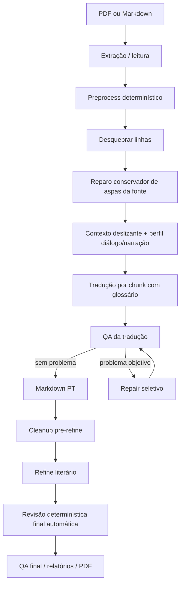

# Pipeline de Tradução

Este documento descreve a regra atual do pipeline EN -> PT-BR. A lógica é genérica para qualquer obra; o que muda por projeto é glossário, configuração e modelos.

## Diagrama

## Regra Por Etapa

1. **Extração / leitura**
   - PDF vira texto bruto.
   - Markdown/texto já preparado pode entrar por `traduz-md`.

2. **Preprocess determinístico**
   - Remove ruído de PDF, TOC, URLs promocionais e front matter quando configurado.
   - Não usa LLM.

3. **Desquebrar**
   - Junta linhas quebradas e corrige hifenização de extração.
   - Pode usar LLM (`llm`) ou modo determinístico (`safe`).
   - Antes do chunking, restaura aberturas de diálogo ausentes apenas quando um parágrafo tem um fechamento sem abertura local e a inserção é inequívoca.

4. **Tradução**
   - Traduz EN -> PT-BR por chunk.
   - Injeta apenas termos do glossário que aparecem no chunk.
   - Usa uma janela deslizante de contexto recente, somente leitura, com últimos parágrafos do original e opcionalmente da tradução PT-BR.
   - Reseta a janela ao mudar de capítulo/seção e quando um chunk começa ou termina com separador de cena (`***`, `---`, etc.).
   - Classifica o chunk como diálogo, narração ou misto e injeta instruções específicas para esse perfil.
   - Prefere fronteiras que não atravessem uma fala aberta; quando necessário, estende moderadamente o chunk até o fechamento seguro.
   - Preserva nomes, honoríficos, ordem narrativa e diálogos.
   - Tem retries para truncamento, omissão de diálogo e resíduo do idioma de origem.

5. **QA da tradução**
   - Roda logo após a tradução de cada chunk.
   - Detecta problemas objetivos:
     - frase ou parágrafo ainda em inglês;
     - possível omissão de diálogo;
     - chunk curto demais;
     - termo fonte vazando quando existe termo PT canônico;
     - alias proibido no texto final.

6. **Repair seletivo**
   - Só chama LLM quando o QA encontra problema.
   - Recebe o original no idioma detectado, tradução atual, lista de problemas e glossário do chunk.
   - Corrige apenas os problemas listados.
   - Não deve reescrever o trecho inteiro nem alterar estrutura narrativa.
   - Rejeita reparos que encurtam demais o chunk, removem parágrafos/falas ou apagam o começo já traduzido.
   - O resultado reparado vira a entrada do refine.

7. **Pós-processamento determinístico**
   - Roda no `*_pt.md` antes do refine e novamente no `*_pt_refinado.md`.
   - Corrige artefatos simples como aspas duplicadas, falsos literais recorrentes e erros gramaticais determinísticos.

8. **Cleanup pré-refine**
   - Remove duplicações óbvias e corrige diálogos colados antes do refine.
   - Controlado por `cleanup_before_refine: off|auto|on`.

9. **Refine literário**
   - É opt-in após a tradução (`refine_after_translate: false` ou `--refine`); o subcomando `refina` continua disponível para avaliação isolada.
   - Edita o PT-BR para fluidez, pontuação, ritmo e naturalidade.
   - Recebe apenas os termos canônicos relevantes no chunk PT-BR, evitando contexto de glossário não relacionado.
   - Não deve retraduzir a obra nem mudar estrutura.
   - Mantém uma rede de segurança para resíduos do idioma de origem, mas essa não é sua responsabilidade principal.
   - Quando acionado no fluxo automático, só substitui o texto traduzido se o QA final não cair.

10. **Revisão determinística final automática**
   - Roda após a tradução e novamente após o refine, sem nova chamada de LLM.
   - Corrige problemas mecânicos:
     - `bad_aliases` do glossário;
     - duplicações e caixa de nomes canônicos conhecidos;
     - artigos/gênero conhecidos;
     - headings/subtítulos e marcadores de cena colados;
     - aspas malformadas e correções editoriais conservadoras.
   - Gera QA e relatório por saída. O mesmo processo pode ser aplicado manualmente com `scripts/review_translation.py --finalize`.

11. **QA final / relatórios**
    - Gera métricas de tradução, repair e refine.
    - Com `--debug`, grava manifests e arquivos por chunk em `saida/debug_runs/`.

## Modularidade Por Obra

- Troque o glossário via `--manual-glossary` ou `glossario/glossario_geral.json`.
- Use `source_aliases` apenas para busca no original.
- Um alias de origem, por si só, não exige que a saída expanda a forma canônica; isso evita tratar abreviações naturais como erro.
- Use `source_case_sensitive: true` em termos técnicos cujo nome coincide com uma palavra comum em inglês; a busca e o QA só consideram a grafia canônica, como `Freeze` e não `freeze`.
- Use `bad_aliases` para formas proibidas no texto final.
- Use `allowed_target_aliases` para formas aceitas que contam como tradução válida no QA e não devem gerar falso positivo.
- Use `target_replacements` para correções contextuais de uma forma final proibida, por exemplo quando a troca exige ajustar artigo ou preposição.
- Use `enforce: true` quando a forma `pt` for obrigatória tanto para a chave quanto para seus aliases de origem. `locked` protege a entrada do glossário contra atualizações automáticas, mas não ativa enforcement por si só.
- O glossário dinâmico padrão é isolado por obra em `saida/<slug>_glossario_dinamico.json`; use `--dynamic-glossary` para um caminho explícito.
- O algoritmo de QA/repair não depende de personagens ou termos de uma obra específica.

## Artefatos Principais

- Tradução reparada: `saida/<slug>_pt.md`.
- Repair report: `saida/<slug>_repair_report.json`.
- Repair metrics: `saida/<slug>_repair_metrics.json`.
- Debug do repair: `saida/debug_runs/<slug>/<run>/45_repair/`.
- Refine final: `saida/<slug>_pt_refinado.md`.
- Revisão final: `saida/<slug>_pt_review_report.json`, `saida/<slug>_pt_refinado_review_report.json` e `saida/<slug>_source_sections.json`.
- Tempos por etapa: `saida/<slug>_timings.json` e, com `--debug`, `99_reports/timings.json`.
